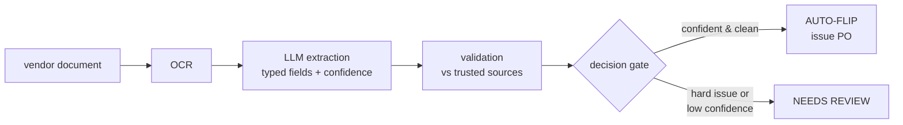

# Flip to PO — GenAI purchase-order automation


An end-to-end pipeline that reads an unstructured vendor document, extracts the
order as typed fields, validates every field against trusted master data, and
then **decides whether the purchase order is safe to issue automatically or
should go to a human**. It runs fully offline by default and ships with an
evaluation harness that measures not just extraction accuracy but the thing that
actually matters for automation — *how safe the auto-issued set is*.

> **Clean-room project, synthetic data.** This is an independent reimplementation
> I built from scratch to demonstrate the design publicly. It contains **no
> proprietary code and no company data** — every vendor, material, price, and
> document in this repo is generated by [`scripts/generate_synthetic_data.py`](scripts/generate_synthetic_data.py).
> It mirrors the *shape* of a procurement-automation system I shipped in
> production, not its internals.

---

## The problem

In a large procurement operation, a big share of purchasing is low-risk and
repetitive: items already covered by a negotiated contract, or low-value lines
that don't need fresh negotiation. For those, a buyer is essentially copying
numbers from a vendor's quotation into the ERP and clicking "issue PO." That work
is automatable — *if* you can read the document reliably and *if* you can be
confident enough in each field to skip the human check.

"Confident enough" is the whole game. An extractor that is 95% right at the field
level will still get a meaningful fraction of whole orders wrong, and you cannot
auto-issue a wrong purchase order. So the system is built around a question that
is more useful than "how accurate is the model?":

> **Of the orders we choose to issue automatically, how many are completely
> correct — and can we keep that number high while still automating a large
> share of the volume?**

## How it works

Four stages, with the final decision gated on a calibrated confidence score and
hard business rules. Full write-up in [`docs/architecture.md`](docs/architecture.md).



1. **OCR** (`ocr/`) — turns the document into text behind a one-method interface
   (`MockOCR` offline; Textract/Tesseract would drop in here).
2. **Extraction** (`extraction/`) — turns text into a typed `ExtractionResult`
   where **every field carries its own confidence**. Two backends sit behind one
   interface: a deterministic `MockLLMExtractor` (used for the offline eval) and a
   real `OpenAIExtractor` with a grounded, schema-constrained prompt.
3. **Validation** (`validation/`) — cross-checks vendor, material, arithmetic, and
   contract price against trusted masters, tagging each issue **HARD** (blocks
   auto-issue) or **SOFT** (penalizes confidence).
4. **Decision gating** (`validation/confidence.py`) — aggregates field confidence
   (taking the *minimum*, so one weak field is enough to trigger review) and emits
   `AUTO_FLIP`, `NEEDS_REVIEW`, or `REJECTED` with a serializable audit trail.

## Quickstart

```bash
pip install -e ".[dev]"     # or: pip install -r requirements.txt
make data                   # generate the synthetic dataset + trusted masters
make demo                   # walk through 3 representative requisitions
make eval                   # full evaluation -> eval/results.json
make sweep                  # threshold sweep   -> eval/sweep.json
make test                   # 24 tests
make api                    # FastAPI service at http://127.0.0.1:8000/docs
```

Everything above runs **without an API key**. To exercise the real LLM path:

```bash
pip install -e ".[openai]"
export FLIP_EXTRACTION_BACKEND=openai
export OPENAI_API_KEY=sk-...
make demo
```

## Results

On 160 synthetic requisitions (305 line items) with a deliberately noisy document
set — about 40% of lines carry at least one OCR/extraction defect — at the default
auto-flip threshold of **0.90**:

**Field-level extraction accuracy**

| Field | Accuracy | | Field | Accuracy |
|---|---:|---|---|---:|
| material_code | 94.8% | | unit_price | 97.7% |
| description | 94.4% | | line_total | 91.5% |
| quantity | 97.4% | | vendor | 100% |
| unit | 94.4% | | currency | 100% |

Macro field accuracy **95.0%**; whole-line exact match **75.1%**; whole-requisition
exact match **57.5%**. (The gap between 95% per-field and 75% per-line is exactly
why per-order gating is necessary — small independent error rates compound across
fields.)

**Automation safety** — the metrics that decide whether this can run unattended:

| Metric | Value | Meaning |
|---|---:|---|
| Auto-flip rate | **53.8%** | share of requisitions issued automatically |
| Auto-flip precision | **94.2%** | of auto-issued orders, share fully correct |
| Review recall | **92.7%** | of genuinely wrong orders, share caught and sent to a human |

|  | auto-flipped | sent to review |
|---|---:|---:|
| **extraction correct** | 81 | 11 |
| **extraction incorrect** | **5** | 63 |

The bottom-left cell — *incorrect, yet auto-issued* — is the only one that costs
money. There are 5 of them, and the next section explains what they are and why
they're hard.

## The interesting part: where the residual error lives

Sweeping the confidence threshold shows the expected trade-off — automate less,
issue more safely:

| threshold | auto-flip rate | auto-flip precision | review recall | incorrect auto-flips |
|---:|---:|---:|---:|---:|
| 0.80 | 55.0% | 93.2% | 91.2% | 6 |
| 0.90 | 53.8% | 94.2% | 92.7% | 5 |
| 0.95 | 44.4% | 94.4% | 94.1% | 4 |
| 0.98 | 44.4% | 94.4% | 94.1% | 4 |

But notice precision barely moves — raising the bar from 0.80 to 0.98 only takes
it from 93% to 94%, while automation falls 10 points. **Tightening confidence
does not fix the residual errors.** That's because of what they are.

Almost every injected error mode is caught by the validation layer rather than by
confidence: a wrong material code fails the master lookup; a broken `qty × price`
fails the arithmetic check; an off-contract price fails the contract check; a
garbled unit or an illegible description shows up as low confidence. The one field
with **no independent source of truth is quantity** — there is no "expected
quantity" to validate against. So a *confident misread of the quantity*, with the
line total recomputed to stay internally consistent, sails through every check.
It is the system's true blind spot, and because the model is confident about it, a
higher confidence threshold can't help.

The honest mitigations are structural, not statistical, and one is already in the
code: a **value gate** (`review_above_value`) that routes any line above an
approval limit to a human regardless of confidence, bounding the cost of exactly
this failure. The next step would be an authoritative quantity signal (e.g.
reconciling against the requisition's own quantity in the ERP).

Surfacing this — rather than tuning it away — is the point. A system that issues
real POs should be able to say precisely how often it can be wrong, and why.

## Design decisions worth calling out

- **Gate on confidence × rules, not accuracy.** The product decision is binary
  (issue or don't), so the system optimizes the safety of the *issued* set, and
  the eval measures that directly (precision/recall of the auto-flip decision),
  not just field accuracy.
- **Minimum-field aggregation.** Overall confidence is the *min* across fields, not
  the mean — one shaky field pulls the whole order to review. Conservative on
  purpose.
- **Two-tier price policy.** A small drift from the contract price is plausible and
  only dents confidence (SOFT); a large deviation is treated as an error (HARD).
- **A non-confidence safety net.** The value gate catches high-cost errors that
  confidence can't, mirroring real procurement approval limits.
- **One interface, two backends.** Mock and OpenAI extractors are interchangeable,
  so the prompt-engineering is real and visible, yet the demo, the tests, and the
  eval all run offline and deterministically.
- **Config is data.** Every business-relevant number lives in `config.py` and is
  overridable by environment variable, so thresholds can be reviewed and swept
  instead of hidden in code.

## What's mocked vs. what would be production

| Concern | In this repo | In production |
|---|---|---|
| OCR | `MockOCR` reads a text rendering | AWS Textract / Tesseract behind `OCREngine` |
| LLM | deterministic `MockLLMExtractor` | `OpenAIExtractor` (included) or another provider |
| Trusted sources | two JSON files | ERP vendor & contract masters |
| Delivery | CLI demo + FastAPI endpoint | REST integration into the procurement system |
| Monitoring | the eval harness + JSON artifacts | a live dashboard (accuracy, adoption, auto-flip rate) |

## Project layout

```
src/flip_to_po/      OCR, extraction (mock + OpenAI), validation, gating, API
scripts/             synthetic-data generator, CLI demo
eval/                evaluation harness, report, threshold sweep
tests/               24 unit + end-to-end tests
data/                generated trusted masters + synthetic documents (committed)
docs/architecture.md full design write-up
```

## Notes

This repo is a portfolio piece. The production system it is modeled on was built
for a procurement category covering tens of thousands of PO lines and ~US$100M in
annual spend, was de-risked with A/B testing and UAT, reached fully autonomous PO
issuance as field accuracy climbed into the 85–95% range, and eliminated ~887
work-hours in its first year. None of that code or data is reproduced here; this
is a clean re-expression of the architecture and the ideas behind it.

## License

MIT — see [LICENSE](LICENSE).
