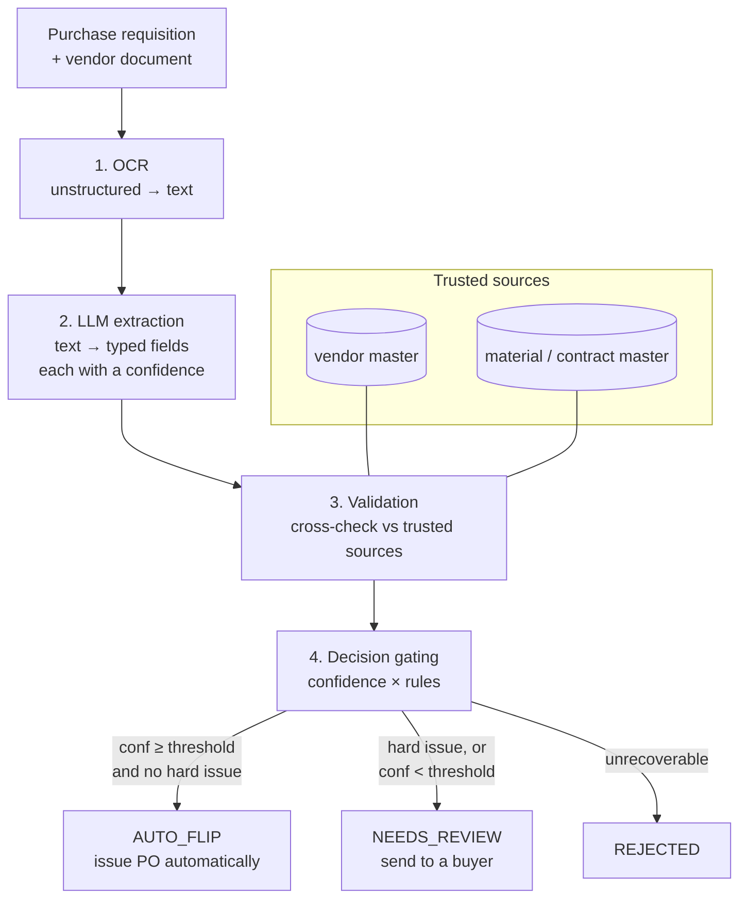

# Architecture

Flip to PO turns an unstructured vendor document into one of three outcomes —
**auto-issue**, **route to a human**, or **reject** — by chaining four stages and
gating the final decision on a calibrated confidence score plus hard business
rules. The design goal is not "extract perfectly" (no extractor does); it is to
**make the auto-issued set safe enough to trust without a human in the loop**,
and to send everything else to a buyer.



## Stage 1 — OCR (`ocr/`)

Converts the unstructured document into plain text. The interface is a one-method
abstract base class, `OCREngine.read(path) -> str`. The repo ships `MockOCR`,
which reads a deterministic text rendering of each synthetic quotation, so the
whole pipeline runs offline. In production this is the seam where AWS Textract or
Tesseract would plug in behind the same interface.

## Stage 2 — LLM extraction (`extraction/`)

Turns OCR text into a typed `ExtractionResult`: a vendor code, a currency, and a
list of line items, where **every field is a `FieldValue(value, confidence)`**.
Two interchangeable backends implement `LLMExtractor.extract(pr, ocr_text)`:

- `MockLLMExtractor` — a deterministic parser that mirrors the failure modes of a
  real model. It splits rows on column whitespace, repairs common OCR
  look-alikes (`O→0`, `l→1`, `S→5`, …) and **lowers the confidence it reports
  when it does so**, detects illegible (`###`) descriptions and unknown units,
  and floors confidence on parse failures. This is what makes the offline eval
  meaningful: confidence is correlated with correctness by construction.
- `OpenAIExtractor` — a real backend (`prompts.py` holds the system prompt, a
  strict JSON schema, and a grounding/self-reported-confidence instruction). It
  is selected with `FLIP_EXTRACTION_BACKEND=openai`; nothing else changes.

Keeping both behind one interface means the prompt-engineering work is visible and
runnable, while CI and `make eval` never need an API key.

## Stage 3 — Validation (`validation/rules.py`, `validation/trusted.py`)

Cross-checks the extraction against authoritative data (`TrustedSources`: a vendor
master and a material/contract master) and emits `ValidationIssue`s, each tagged
with a **severity** that encodes the business policy:

| Severity | Meaning | Examples |
|---|---|---|
| `HARD` | Blocks auto-issue outright | unknown / inactive vendor, unknown material, `qty × price ≠ total`, price > contract by more than the hard band, parse failure, **line value over the approval limit** |
| `SOFT` | Allowed, but penalizes confidence | small off-contract price drift, unit mismatch |

Two ideas here matter. First, **price has two tiers**: a small drift from the
contract price is plausible (a price update) and only dents confidence, while a
large deviation is treated as an error and blocks. Second, the **value gate** is a
non-confidence safety net: any line above the approval limit is sent to a human no
matter how confident the model is, which bounds the financial blast radius of a
single mistake.

## Stage 4 — Decision gating (`validation/confidence.py`)

Aggregates everything into one decision:

```
overall_confidence = min(field confidences) × (1 − soft_penalty) ^ (#soft issues)

if any HARD issue            -> NEEDS_REVIEW
elif overall ≥ threshold     -> AUTO_FLIP
else                         -> NEEDS_REVIEW
```

Taking the **minimum** field confidence (not the mean) means a single shaky field
is enough to pull a requisition into review — the conservative choice for a system
that issues real purchase orders. The result is a `FlipResult` carrying the
decision, the aggregated confidence, a human-readable rationale, and a fully
serializable audit trail (`to_audit_dict()`).

## Why these seams

Every stage is an abstract base class with a swappable implementation, every
business-relevant number lives in `config.py` (so it can be reviewed and swept),
and the same `FlipPipeline` object backs the demo, the FastAPI service, and the
evaluation harness. That is what lets the project ship a real prompt-engineered
LLM path while still running — and being measured — completely offline.
